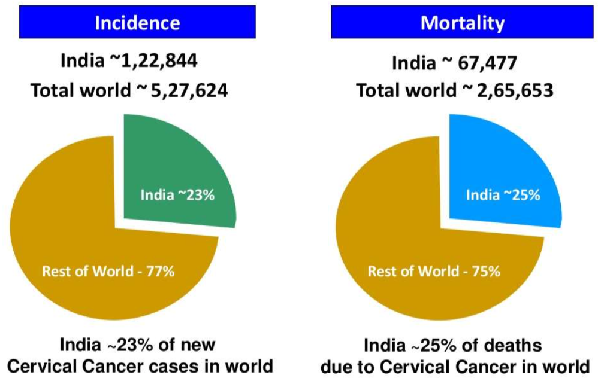
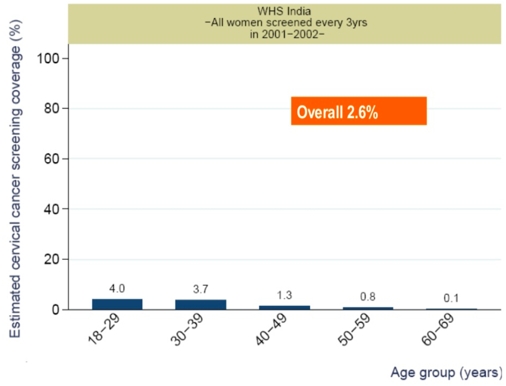

# Background
We are international cancer researchers and clinicians working in the field of cancer prevention and that we have gathered some of our colleagues to develop a primary cancer prevention strategy. 

Our goal is to increase HPV vaccination rates for cervical cancer prevention in India, so that it could later be adapted to other countries.

#  

#  

# Stakeholders

- Central and state governments
- Family and Health Welfare Ministry workers
- The district mayors
- Pediatrician / Gynecologist
- School teachers
- Primary healthcare workers
- Parents
- Patient Advocates

# Target Population

For improved HPV vaccination rates, our target population will be 

- girls,
- 11-16 years old,
- in all public and private schools nationwide, and also
- at the primary health center nationwide, on an ongoing basis.

# Objectives

1. Identify the stakeholders and form a working committee by 2019 that will validate the education program for parents, teachers and healthcare workers by 2020.
2. Work with the central government to develop and approve the HPV vaccination program by 2020 and implement it by 2021.
3. Vaccinate at least 40 percent of the population by 2022.

# Education

- Mass communication (TV, Newspapers, Radio, Social Media)
- Involving celebrities for campaigning
- Advertisements in 
    - public transportation, 
    - schools/universities, and 
    - shopping malls

# Barriers

- Cost of vaccines
- Perception of adverse effects and risks
- Concerns about allergies (to vaccines in general and yeast and latex, which is a component of Gardasil)

# Program Evaluation

- Vaccination rate (Short-Term)
    - According to school and health center registries
- Cervical Cancer Incidence Rate (Long-Term)
    - by cancer registry program

# Final Thoughts

Process: Was a national strategy created? Was funding allocated? How many individuals saw the adverts?

Outcome: Did the average school-age child vaccination rate increase?

Impact: Over time, does India’s vaccination rate increase? Do cervical cancer incidence rates decline?

# 

<audio controls>
    <source src="music.mp3" type="audio/mpeg">
</audio>

